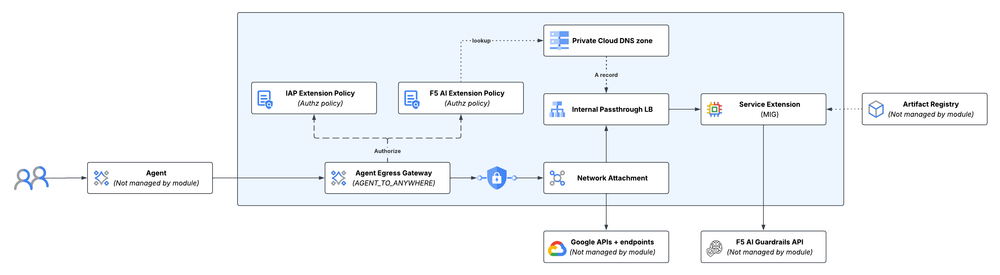

# F5 AI Agent Gateway

This repo prepares a minimal environment for Google [Agent Gateway] extension testing.

Figure 1. Resources created by this repo are contained in the blue box.

1. A VPC is created with two active subnets:
   * Service extension and supporting workloads are attached to the `primary` subnet (10.0.0.0/16)
   * Agent Gateway is attached to the `psc` subnet (172.18.0.0/24) via network attachment, and DNS peering with the
     private Cloud DNS zone

   > NOTE: The default deployment creates a VPC that does not adhere to F5 best practices. It deliberately allows
   > unrestricted egress to the internet without Cloud NAT, Secure Web Gateway, or F5 appliance.

1. The service extension under test is deployed as a Compute Engine MIG
   * VMs are instantiated with a public IP address to support egress and external service calling
   * The service extension is automatically started by systemd through `docker run` with always pull
   * Direct access to the VMs is blocked by Google Cloud's default deny firewall rule
     * Ports 80, 443, and 8080 are exposed to VPC traffic, with ingress permitted from the `primary` and `psc` subnet
       CIDRs
     * OS Login is enabled on VMs, with SSH ingress via IAP permitted from anywhere; use
       `gcloud compute ssh INSTANCE_NAME --zone ZONE --project PROJECT_ID --tunnel-through-iap` to login to VMs as
       needed
1. An ILB provides disaggregation to active VMs allowing VM recreation and redeployment as needed
   * The IPv4 address of the ILB is registered as an A record in the private Cloud DNS zone peered with Agent Gateway
1. The Agent Gateway resource is created with Authz policies for IAP and the service extension to be
   tested, resolving the latter through DNS lookup
1. Agent(s) can be deployed using any supported method that allows specifying an Agent Gateway for egress.

Once deployed, all Agent -> something traffic should be intercepted and passed to the service extension for inspection
and analysis.

<!-- markdownlint-disable no-inline-html no-bare-urls -->
<!-- BEGIN_TF_DOCS -->
## Requirements

| Name | Version |
| ---- | ------- |
|  [terraform](#requirement\_terraform) | >= 1.5 |
|  [google](#requirement\_google) | >= 7.16 |

## Modules

No modules.

## Resources

| Name | Type |
| ---- | ---- |
| [google-beta_google_network_services_agent_gateway.egress](https://registry.terraform.io/providers/hashicorp/google-beta/latest/docs/resources/google_network_services_agent_gateway) | resource |
| [google_artifact_registry_repository_iam_member.ar](https://registry.terraform.io/providers/hashicorp/google/latest/docs/resources/artifact_registry_repository_iam_member) | resource |
| [google_compute_address.ilb](https://registry.terraform.io/providers/hashicorp/google/latest/docs/resources/compute_address) | resource |
| [google_compute_firewall.allow_hc](https://registry.terraform.io/providers/hashicorp/google/latest/docs/resources/compute_firewall) | resource |
| [google_compute_firewall.allow_primary](https://registry.terraform.io/providers/hashicorp/google/latest/docs/resources/compute_firewall) | resource |
| [google_compute_firewall.allow_proxy](https://registry.terraform.io/providers/hashicorp/google/latest/docs/resources/compute_firewall) | resource |
| [google_compute_firewall.allow_psc](https://registry.terraform.io/providers/hashicorp/google/latest/docs/resources/compute_firewall) | resource |
| [google_compute_firewall.iap](https://registry.terraform.io/providers/hashicorp/google/latest/docs/resources/compute_firewall) | resource |
| [google_compute_forwarding_rule.ilb](https://registry.terraform.io/providers/hashicorp/google/latest/docs/resources/compute_forwarding_rule) | resource |
| [google_compute_network.network](https://registry.terraform.io/providers/hashicorp/google/latest/docs/resources/compute_network) | resource |
| [google_compute_network_attachment.psc](https://registry.terraform.io/providers/hashicorp/google/latest/docs/resources/compute_network_attachment) | resource |
| [google_compute_region_backend_service.ilb](https://registry.terraform.io/providers/hashicorp/google/latest/docs/resources/compute_region_backend_service) | resource |
| [google_compute_region_health_check.extension](https://registry.terraform.io/providers/hashicorp/google/latest/docs/resources/compute_region_health_check) | resource |
| [google_compute_region_health_check.ilb](https://registry.terraform.io/providers/hashicorp/google/latest/docs/resources/compute_region_health_check) | resource |
| [google_compute_region_instance_group_manager.mig](https://registry.terraform.io/providers/hashicorp/google/latest/docs/resources/compute_region_instance_group_manager) | resource |
| [google_compute_region_instance_template.extension](https://registry.terraform.io/providers/hashicorp/google/latest/docs/resources/compute_region_instance_template) | resource |
| [google_compute_subnetwork.primary](https://registry.terraform.io/providers/hashicorp/google/latest/docs/resources/compute_subnetwork) | resource |
| [google_compute_subnetwork.proxy](https://registry.terraform.io/providers/hashicorp/google/latest/docs/resources/compute_subnetwork) | resource |
| [google_compute_subnetwork.psc](https://registry.terraform.io/providers/hashicorp/google/latest/docs/resources/compute_subnetwork) | resource |
| [google_dns_managed_zone.internal](https://registry.terraform.io/providers/hashicorp/google/latest/docs/resources/dns_managed_zone) | resource |
| [google_dns_record_set.ilb](https://registry.terraform.io/providers/hashicorp/google/latest/docs/resources/dns_record_set) | resource |
| [google_network_security_authz_policy.f5-ai-ext-content](https://registry.terraform.io/providers/hashicorp/google/latest/docs/resources/network_security_authz_policy) | resource |
| [google_network_security_authz_policy.iap](https://registry.terraform.io/providers/hashicorp/google/latest/docs/resources/network_security_authz_policy) | resource |
| [google_network_services_authz_extension.f5-ai-ext-content](https://registry.terraform.io/providers/hashicorp/google/latest/docs/resources/network_services_authz_extension) | resource |
| [google_network_services_authz_extension.iap](https://registry.terraform.io/providers/hashicorp/google/latest/docs/resources/network_services_authz_extension) | resource |
| [google_project_iam_member.roles](https://registry.terraform.io/providers/hashicorp/google/latest/docs/resources/project_iam_member) | resource |
| [google_service_account.sa](https://registry.terraform.io/providers/hashicorp/google/latest/docs/resources/service_account) | resource |
| [google_compute_image.cos](https://registry.terraform.io/providers/hashicorp/google/latest/docs/data-sources/compute_image) | data source |
| [google_compute_zones.zones](https://registry.terraform.io/providers/hashicorp/google/latest/docs/data-sources/compute_zones) | data source |
| [google_project.project](https://registry.terraform.io/providers/hashicorp/google/latest/docs/data-sources/project) | data source |

## Inputs

| Name | Description | Type | Default | Required |
| ---- | ----------- | ---- | ------- | :------: |
|  [name](#input\_name) | The base name to use for resources created by this module. | `string` | n/a | yes |
|  [project\_id](#input\_project\_id) | The Google Cloud project identifier that will contain the resources. | `string` | n/a | yes |
|  [public\_dns](#input\_public\_dns) | An optional value, `base_domain` sets the root for public TLS certificate creation and DNS challenges, and becomes the base for a VPC private DNS zone for GKE services (`internal.{public_dns.base_domain}`). An optional `managed_zone_id` value containing a Cloud DNS Managed Zone identifier can be provided to have the DNS challenges added automatically. | <pre>object({     base_domain     = string     managed_zone_id = optional(string)   })</pre> | n/a | yes |
|  [service\_extension\_container\_image](#input\_service\_extension\_container\_image) | The qualified container image to use as a service extension on this VM. You must supply this value with a valid private Artifact or Container Repository identifier, or a public repo identifier. | `string` | n/a | yes |
|  [enforce\_iap](#input\_enforce\_iap) | If true, the IAP policy associated with the Agent Egress Gateway will be enforced; if false (default), IAP policy will be set to DRY\_RUN which will log policy violations but not block them. | `bool` | `false` | no |
|  [labels](#input\_labels) | An optional map of key:value labels to apply to the resources. Default value is an empty map. NOTE: The effective set of labels will include some fixed values in addition to these. | `map(string)` | `{}` | no |
|  [region](#input\_region) | The Compute Engine region name in which to create resources. Default is 'us-central1'. | `string` | `"us-central1"` | no |
|  [repositories](#input\_repositories) | Existing private Artifact Registries that will be used for deployments. The service account for the clusters will be given automatic IAM role to pull from these registries if it is not empty. | `set(string)` | `null` | no |

## Outputs

No outputs.
<!-- END_TF_DOCS -->
<!-- markdownlint-enable no-inline-html no-bare-urls -->

[Agent Gateway]: https://docs.cloud.google.com/gemini-enterprise-agent-platform/govern/gateways/agent-gateway-overview
